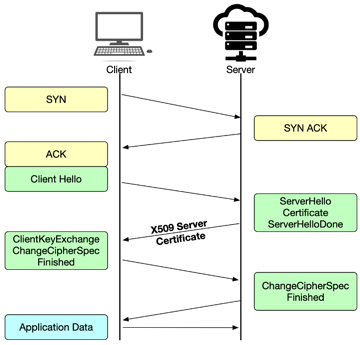
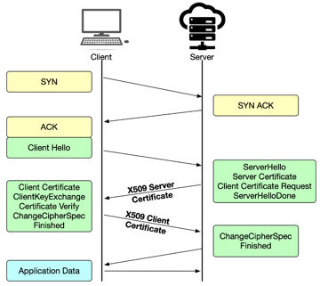
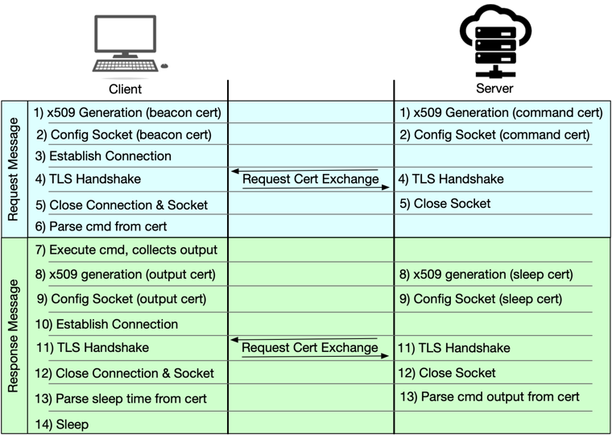

# Secret Handshake - A Malware C2 Channel Using x509 Certs Over mTLS 

## Motivation
First off, why would I open source this? 

MITRE ATT&CK only talks about stolen or self-signed certs, and NDRs 
(as far as I can tell) pay very little attention to the content of x509 certificates outside of who is 
the issuing CA. In general x509 certificates are trusted and  allowed to pass through our firewalls
with impunity. But in essence they are just files that can easily contain malicious payloads like any other. 
We trust and ignore them because they are a core component to an encryption process that we’ve come to take 
for granted. The primary goal of this project is to bring a heightened awareness to a class of security indicator 
that we have come to trust, and highlight methods that can be used to detect malicious uses of it.

## Background
I always wondered if threat actors have ever used x509 certificates as part of their C2 communication, not to encrypt 
the network traffic, but to actually embed the C2 communication in the x509 cert. After searching for something like 
this in the wild for 5 years I finally decided to just code it myself to see if it's possible...it is.

Every single encrypted message sent over HTTPS/TLS is enabled by the transfer of an x509 certificate. 
When establishing a TLS handshake (figure below), during the fourth step the server sends its x509 certificate 
to the client. The client verifies the certificate, compares the encryption algorithms the server supports 
and chooses which algorithm to use for all further communication.

As this diagram shows, this is only a one-way transfer of the x509 certificate from the server to the client.
This does not lend itself well to C2 communication because there is no way for the client to respond back
to the server. At best, it could only be used as a one-way data transfer mechanism (see prior art section below). 

But there is another type of TLS session called mutual TLS Authentication (mTLS), where both the client and the server 
exchange x509 certificates as a way to authenticate each other.

As the figure above shows, during mutual authentication the server’s x509 certificate is sent to the client for 
authentication, and then the client’s x509 certificate is sent to the server for authentication. 
This exchange of artifacts represents an opportunity to create a 2-way communication channel for C2 servers.

## Creating a 2-way communication channel via x509 certificates

Since the server and client certificates are exchanged by the underlying SSL library
there isn't an opportunity for the client to pull the message out of the server's cert, run the command,
and generate a response certificate all within a single mTLS connections. This means the C2 channel
needs to be designed such that the request-reply exchange takes place over two different mutual TLS connections, 
kind of like a pseudo-half duplex transmission mode.

The request/response process follows the following steps:
- Step 1: both the client and the C2 server generate their respective certificates. The client’s certificate contains 
a generic “beacon” message, and the server’s certificate contains the command it wants the client to run. 
If there is no command for the client to execute the server generates a generic “sleep” certificate to tell the 
client how long to sleep before the next beacon.
- Step 2: both the client and the C2 server configure a network socket with the certificates generated in step 1.  
- Step 3: the client establishes a connection with the server.
- Step 4: the server and client certificates are exchanged during the mTLS handshake.
- Step 5: both the server and the client close their respective sockets.
- Step 6: the client extracts the command to execute from the server certificate. Since the client’s certificate 
just contains a generic “beacon” message, the server discards it.
- Step 7: The client executes the command and collection the command output.
- Step 8: both the client and the C2 server generate their respective certificates. The client’s certificate contains 
the output from the command it just executed, and the server generates a generic “sleep” certificate to tell the client 
how long to sleep before the next beacon.
- Step 9: both the client and the C2 server configure a network socket with the certificates generated in step 8.
- Step 10: the client establishes a connection with the server.
- Step 11: the server and client certificates are exchanged during the mTLS handshake.
- Step 12: both the server and the client close their respective sockets.
- Step 13: the client extracts the sleep duration from the server certificate, and the server extracts the command
output from the client certificate.
- Step 14: the client sleeps for the interval specified by the server.

## Prior Art
After I got this working I was pretty proud of myself for being all creative and stuff.

Then I ran across this [BSides talk in 2018 by Jason Reaves](https://www.netresec.com/?page=Blog&month=2018-02&post=Examining-an-x509-Covert-Channel) 
who wrote a malware binary dropper using x509 certs over TLS. A year later Jason 
[published this paper](https://vixra.org/pdf/1801.0016v1.pdf) detailing a full 2 way communication channel using mTLS.

## Instructions To Run

mTLS requires that both the client and the server's certificates are signed by the same CA cert, so the first 
step is to generate your own CA private key / certificate pair

Create root CA private key:

`openssl genrsa -des3 -out hmCA.key 2048`

note: The passphrase will prevent anyone who gets your private key from generating a root certificate of their own.

Create root CA certificate

`openssl req -x509 -new -nodes -key hmCA.key -sha256 -days 1825 -out hmCA.pem`

Copy the generated key and cert files into the `certs/ca_certs` folder. The project comes with a demo 
key/cert pair, so you can skip this step if you want.

Start the client: 

`python client.py`

Start the server: 

`python server.py`

## Detections
_I never want to release something potentially malicious without also detailing how to detect it in your network logs._

You'd think detecting this type of TLS pattern would be easy, but it's not that simple. One of the main tells 
of this C2 channel is its half-duplex style of communication; it takes two mutual authentication flows to complete 
a full request/reply between the server and the client. This will then happen multiple times as the server
is sending different commands to the client.

This means you should look for:
- Multiple mTLS sessions between the same source and destination IP, probably on the same port, though it wouldn't be 
hard to configure this to walk different ports per mTLS connection. 
- Since the request-reply pattern requires two mTLS session per server command look for 2 mTLS session fairly 
close together, with a longer pause between the next pair of mTLS sessions.
- Look for sleep and jitter times between pairs of mTLS sessions the same as you would any other C2 channel
- The cert hashes should be different for each mTLS session, as new certs are generated per session
- Certs will not be issued by trusted certificate authorities
- x509 certificate byte sizes will also vary per session. Small server certs should indicate commands being sent
to the client, but larger certs would most likely indicate a download of a malicious binary. Client certs
will probably vary in size more than server command certs, since they are embedding command output. Large
client certs would indicate data exfiltration.
- If there are multiple mTLS sessions between the same source and destination IPs over a short period of time, 
look to see if sometimes certs with the same hash are sent. This could indicate reuse of command / response 
certs, like a "beacon" client cert or a "sleep" server cert. 

This seems like a slam dunk set of detection rules, but like I said before it's not that easy. Turns out there
are a set of enterprise services that also have a similar mTLS traffic pattern, including 
- Tanium
- Microsoft System Center Configuration Manager (SCCM)
- Microsoft Monitoring Agent
- Azure Hybrid Runbook Worker
- Palo Alto Networks
- MuleSoft
- TrustedSource
- Cohesity Helios
- EMC's Global Security Organization
- Alert Logic

Several of these seem to be asset/device management services, so in theory they should be sending the same set 
of certificates each time they run through all their devices. You could look to see if there are sets of
multiple mTLS session repeating every N hours, and then see if the cert hashes between two different sets
of mTLS sessions match, or mostly match. Also, potentially look for the client certs to be different for each mTLS 
session, but the same server cert across all sessions.

## Potential Mitigation

SSL inspection is one way to potentially block this type of C2 communication channel as the SSL inspection server 
would not have the malicious CA cert needed to authenticate the client certificate.
